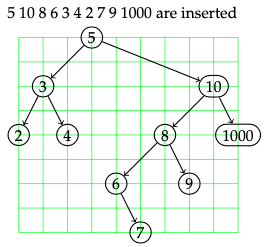
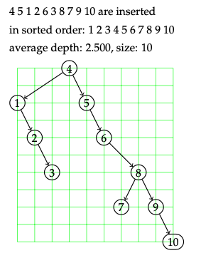
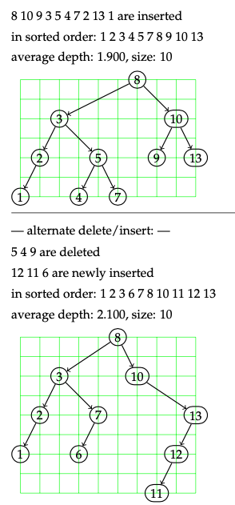
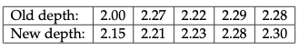

# Automatically produce LaTeX code for a visualisation of a Binary Search Tree

This Java program can help you visualise what a [Binary Search Tree](https://en.wikipedia.org/wiki/Binary_search_tree) would look like for varying input sets.
Please see below for functionality, examples and instructions.

## Functionality

**1) Generating a binary search tree for explicit input.**

*Example input: 5 10 8 6 3 4 2 7 9 1000* 

There must be more than 3 values in the input for it to work as intended.

**2) Random permutation of the first n natural numbers**

Input: n (where n roughly <= 50)

*Example input: 10*

Generates a random permutation of {1,2,...,10} and inserts them into the tree.

**3) Alternating insertions and deletions**

Input: n, d (where d < n, n <= 50)

*Example input: 10, 3* 

First it will generate a random permuation of {1,...,n+d} and insert only the first n into the tree.
It will then compute the average depth of that tree and will output the graph. Next it will compute another random permutation of {1,...n}, where the first d of these numbers are the indices of the numbers to be deleted from the original {1,...n+d} permuation. The program then procedes to delete to indice and then insert a 
a value in the order the were left out in the original permutation {n+1, ..., n+d} and repeats this deleting and inserting d times. The output looks like the following:

**4) Compare average tree depths for alternating insertions and deletions**

Input: n, d, r (where d < n, n<=50, r < ~15)

*Example input: 10, 3, 5*

In 3) we saw the tree change after modifying the original tree by deleting certain nodes and then adding a new node to the tree.
This part of the functionality allows us to analyse the change in average tree depth when repeat the process in 3) *r* times.
The output is a neat table comparing the old and new tree depths after the insertion and deletion process. 

___
## Instructions

- To run the Java program you must have the [Java JDK](https://adoptopenjdk.net/releases.html) installed.

- Once you have that installed, in your local shell (terminal, command prompt etc.) navigate to the folder/directory where you have the two classes 'Tree.java' and 'Graph.java' saved.

- To run the program, type ``javac Tree.java`` followed by ``java Tree [input] > [name].tex``. This will generate a ``.tex`` file with the code to generate the graph. You can then type ``pdflatex [name].tex`` to produce a pdf file where you can see graph.
If you do not have a LaTeX compiler installed or this doesn't work for some unknown reason, then you can always use online compilers like [Overleaf](https://www.overleaf.com/) to view the graph. Simply change the output extension to `.txt` and paste this into Overleaf. A benefit of using overleaf is that all packages needed are pre-installed.

## Notes
- The code presented in this repo is free to be used and adapted by GitHub users for their individual needs.

- The inputs are mere guides such that the program produces acceptable formatting.

