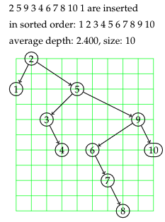

# Automatically produce LaTeX code for a visualisation of a Binary Search Tree

This Java program can help you visualise what a [Binary Search Tree](https://en.wikipedia.org/wiki/Binary_search_tree) would look like for varying input sets.
Please see below for functionality, examples and instructions.

## Functionality

**1) Generating a binary search tree for explicit input.**

*Example input: 5 10 8 6 3 4 2 7 9 1000* 

There must be more than 3 values in the input for it to work as intended.

**2) Random permuation of the first n numbers**

*Example input: 10*

Generates a random permutation of {1,2,...,10} and inserts them into the tree.

**3) Alternating insertions and deletions**

*Example input: 

**4) Compare average tree depths for varied inputs**

*Example input: n, d, r
___
## Instructions

- To run the Java program you must have the [Java JDK](https://adoptopenjdk.net/releases.html) installed.

- Once you have that installed, in your local shell (terminal, command prompt etc.) navigate to the folder/directory where you have the two classes 'Tree.java' and 'Graph.java' saved.

- To run the program, type ``javac Tree.java`` followed by ``java Tree [input] > [name].tex``. This will generate a ``.tex`` file with the code to generate the graph. If you do not have a LaTeX compiler installed then you can use online editors like [Overleaf](https://www.overleaf.com/) to view the graph. Simply change the output extension to `.txt` and paste this into Overleaf. A benefit of using overleaf is that all packages needed are pre-installed.

